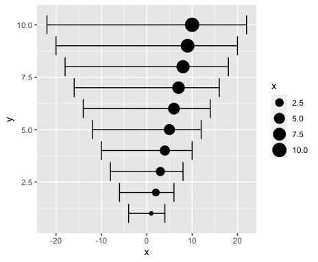
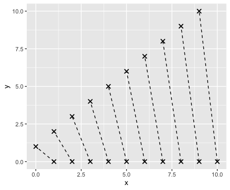

# multigeom

Combining multiple `ggplot2` geoms, with barbell and forest plots examples.
The idea is taken from [the ggplot2 book](https://ggplot2-book.org/extensions.html#combining-multiple-geoms), where the barbell plot was implemented.

Only one dependency of the `ggplot2` package.

```r
remotes::install_github("polkas/multigeom")
```

```r
library(ggplot2)
library(multigeom)
```

## `geom_forest`

```r
df <- data.frame(x = 1:10, y = 1:10, xmin = -2 * 2:11, xmax = 2 * 2:11)
ggplot(
  df,
  ggplot2::aes(x = x, y = y, xmin = xmin, xmax = xmax, size = x)
) + 
  geom_forest()
```



## `geom_barbell`

```r
df <- data.frame(x = 1:10, xend = 0:9, y = 0, yend = 1:10)
ggplot(df, ggplot2::aes(x, y, xend = xend, yend = yend)) + 
  geom_barbell(shape = 4, linetype = "dashed")
```


